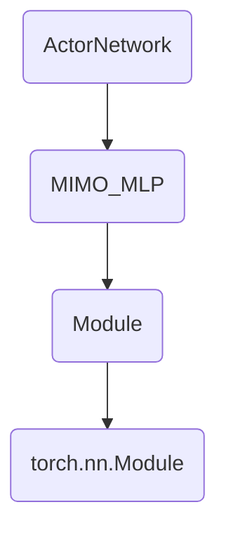
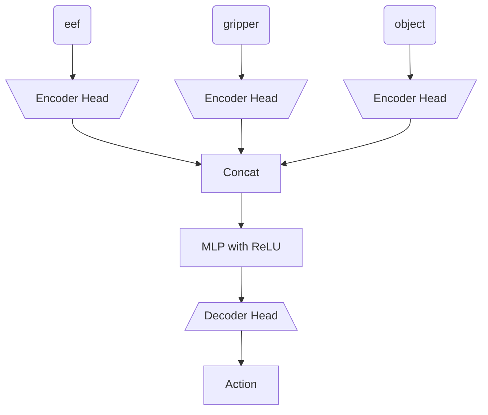

# Diffusion Policy Lift Task

[Diffusion Policy Codebase](https://github.com/real-stanford/diffusion_policy/tree/main/diffusion_policy)

Based on <i> lift_image.yaml </i> and it states that dataset comes from the robomimic dataset

---

# Robomimic

[Robomimic Codebase](https://github.com/ARISE-Initiative/robomimic)

After taking a look at RoboMimic, it seems that understanding this paper is essential for understanding how to do BC on a robot. I would recommend anyone getting into BC to read this paper deeply.

### Pre-Code Dive

[Paper link](https://arxiv.org/pdf/2108.03298)

Based on <i> README.md </i> 3/11/2025 robomimic datasets move to HuggingFace.

<b> IMPORTANT </b> from Robomimic, we see that randomizing object in ADDITION to randomizing robot state (by a little) matters in getting robust performance.

<b> IMPORTANT </b> from Robomimic, we see that BC-RNN performs better by a large margin against just BC (concatenate horizon of observations as features). 


<i> <b>Figure 1:</b> (MG) is machine generated. (PH) is proficient human. (MH) is multi-human. We can see that lift does really well in general. It is perfect for HUMAN demonstrations. However, it is much worse for machine-generated (MG). Either way, we should expect high performance in our task. </i>


The observation that (PH) and (MH) does better than (MG) is actually stated in the paper in their <b> C1 </b> remark. These (C#) remarks are claims they wish to validate.


> <b> (C1) Data from Non-Markovian Decision Process. </b> Human demonstrations can differ substantially
from machine-generated demonstrations because humans may not act purely based on a single current
observation. External factors (teleoperation device, past actions, history of episode) may all play a
role. Prior work [20] has noted substantial benefits from leveraging models that are history-dependent
and / or with temporal abstraction to learn from human demonstrations. We investigate various design
choices related to such architectures in this study.

This would also mean that for (MG) demos, using BC-RNN might not work.


> <b> (C3) Dependence on Dataset Size. </b> Offline policy learning is sensitive to the state and action space
coverage in the dataset, and by extension, the size of the dataset itself. In our study, we investigate
how dataset sizes affect policy performance. This analysis is useful to understand the value of adding
more data – an important consideration since collecting human demonstrations can be costly.

> <b> (C4) Mismatch between Training and Evaluation Objectives. </b> Unlike traditional supervised learning, where model selection can be achieved by using the model with the lowest validation loss [21],
offline policy learning often suffers from the fact that the training objective is only a surrogate for the
true objective of interest (e.g. task success rate), and policy performance can change significantly
from epoch to epoch. This makes it difficult to select the best trained model [19, 28, 29]. In our
study, we evaluate each policy checkpoint online in the environment in simulation, and report the best
policy success rate per training run. We use these ground-truth values to understand the effectiveness
of different selection criteria, and confirm that offline policy selection is an important problem,
especially in real-world scenarios where large-scale empirical evaluation is difficult.

<b> IMPORTANT BIG NOTE </b> (MG) is generated by running a SOTA RL Policy (from 2021) on these tasks. These literally take in one observation horizon and output an action. We should not trust the (MG) results on scripted demos.


These figures don't need much explaning. It just shows how different hyperparameter settings can change the policy's performance (mostly for the worse here).

Now we move into the appendix section of the paper because that is where the juicy pre-code details are.

#### Appendix Info

Policy outputs actions at a rate of 20Hz. Action space is in delta-pose form. Delta-rotation is axis-angle. 

> <b> Lift. </b> Object observations (10-dim) consist of the absolute cube position and cube quaternion (7-dim),
and the cube position relative to the robot end effector (3-dim). The cube pose is randomized at the
start of each episode with a random z-rotation in a small square region at the center of the table.

<b> Simulation Note: </b> All tasks were designed using MuJoCo and the robosuite framework. 

All of the simulation code is actually from robosuite codebase which wraps MuJoCo.

The action horizon was 1 by the way.

---

## Robomimic Code Dive

We start in <i> policy_nets.py </i>

### Policy Network
Our desired BC network implementation is written in <i> ActorNetwork </i> class. This is the inheritance graph for the class:



Here is my notes of the <b> implementation of ActorNetwork </b> where I remove some code and comments for clarity.
```python
class ActorNetwork(MIMO_MLP):
    """
    A basic policy network that predicts actions from observations.
    Can optionally be goal conditioned on future observations.
    """
    def __init__(self, obs_shapes, ac_dim, mlp_layer_dims, goal_shapes=None, encoder_kwargs=None):
        ''' AN NOTE:
        obs_shapes: OrderedDict(string, OrderedDict(string, tuple(int)))
            - string: observation key ('obs' or 'goal')
            - OrderedDict(string, tuple(int))
                - string: observation name ('object', 'eef_quat', 'eef_pos')
                - tuple(int): shape of observation (e.g. (3,), (7,), (10,))
        ac_dim: (int) action dim
        mlp_layer_dims ([int]): specify mlp layers
        '''
        assert isinstance(obs_shapes, OrderedDict)
        self.obs_shapes = obs_shapes
        self.ac_dim = ac_dim

        observation_group_shapes = OrderedDict()
        observation_group_shapes["obs"] = OrderedDict(self.obs_shapes)

        self._is_goal_conditioned = False
        if goal_shapes is not None and len(goal_shapes) > 0:
            assert isinstance(goal_shapes, OrderedDict)
            self._is_goal_conditioned = True
            self.goal_shapes = OrderedDict(goal_shapes)
            observation_group_shapes["goal"] = OrderedDict(self.goal_shapes)
        else:
            self.goal_shapes = OrderedDict()

        output_shapes = self._get_output_shapes()
        super(ActorNetwork, self).__init__(
            input_obs_group_shapes=observation_group_shapes,
            output_shapes=output_shapes,
            layer_dims=mlp_layer_dims,
            encoder_kwargs=encoder_kwargs,
        )
    def _get_output_shapes(self):
        return OrderedDict(action=(self.ac_dim,)) #AN NOTE: only output is action dim (horizon=1)
    def forward(self, obs_dict, goal_dict=None):
        # AN NOTE: actions calls forward from MIMO_MLP
        actions = super(ActorNetwork, self).forward(obs=obs_dict, goal=goal_dict)["action"]
        # apply tanh squashing to ensure actions are in [-1, 1]
        return torch.tanh(actions) #AN NOTE: why does it run tanh here?
```

For the most part, everything makes sense (and maybe too much is abstracted.)

I think I don't quite get why <i> torch.tanh(actions) </i> is such a good idea.
While it squashes actions down to [-1, 1], it 's a nonlinear mapping. I guess if the network can learn anything, the tanh just serves to restrict the action space.

Now we move to the <b> implementation of MIMO_MLP </b>.

```python
class MIMO_MLP(Module):
    """
    Extension to MLP to accept multiple observation dictionaries as input and
    to output dictionaries of tensors. Inputs are specified as a dictionary of 
    observation dictionaries, with each key corresponding to an observation group.

    This module utilizes @ObservationGroupEncoder to process the multiple input dictionaries and

    @ObservationDecoder to generate tensor dictionaries. The default behavior
    for encoding the inputs is to process visual inputs with a learned CNN and concatenating
    the flat encodings with the other flat inputs. The default behavior for generating 
    outputs is to use a linear layer branch to produce each modality separately
    (including visual outputs).
    """
    def __init__(
        self,
        input_obs_group_shapes,
        output_shapes,
        layer_dims,
        layer_func=nn.Linear, 
        activation=nn.ReLU,
        encoder_kwargs=None,
    ):
        """
        Args:
            input_obs_group_shapes (OrderedDict): a dictionary of dictionaries.
                Each key in this dictionary should specify an observation group, and
                the value should be an OrderedDict that maps modalities to
                expected shapes.
            output_shapes (OrderedDict): a dictionary that maps modality to
                expected shapes for outputs.
            layer_dims ([int]): sequence of integers for the MLP hidden layer sizes
            layer_func: mapping per MLP layer - defaults to Linear
            activation: non-linearity per MLP layer - defaults to ReLU
        """
        super(MIMO_MLP, self).__init__()
        self.input_obs_group_shapes = input_obs_group_shapes
        self.output_shapes = output_shapes
        self.nets = nn.ModuleDict()
        # Encoder for all observation groups.
        self.nets["encoder"] = ObservationGroupEncoder(
            observation_group_shapes=input_obs_group_shapes,
            encoder_kwargs=encoder_kwargs,
        )
        # flat encoder output dimension
        mlp_input_dim = self.nets["encoder"].output_shape()[0]
        # intermediate MLP layers
        self.nets["mlp"] = MLP(
            input_dim=mlp_input_dim,
            output_dim=layer_dims[-1],
            layer_dims=layer_dims[:-1],
            layer_func=layer_func,
            activation=activation,
            output_activation=activation, # make sure non-linearity is applied before decoder
        )
        # decoder for output modalities
        self.nets["decoder"] = ObservationDecoder(
            decode_shapes=self.output_shapes,
            input_feat_dim=layer_dims[-1],
        )

    def output_shape(self, input_shape=None):
        return { k : list(self.output_shapes[k]) for k in self.output_shapes }

    def forward(self, **inputs):
        enc_outputs = self.nets["encoder"](**inputs)
        mlp_out = self.nets["mlp"](enc_outputs)
        return self.nets["decoder"](mlp_out)
```

Based on this code, the BC network looks like this:

For the decode head it runs an <i> nn.Linear </i> from the output of the MLP to the action space. Not going to include <i> ObservationDecoder </i> because of my summary.

Actualy it could just be concatenation for state-based BC. It only runs encoder head for RGB observations (see <i> create_obs_encoder </i>).

<b> NOTE </b> The difference between this and mine is that I concatenate the observations beforehand (no encoder heads).

### Training/Sim Details (Action Space)

I think we dug enough into how the <i> ActorNetwork </i> is implemented for us. Now we want to see how it is used in the training loop (and inference time).

