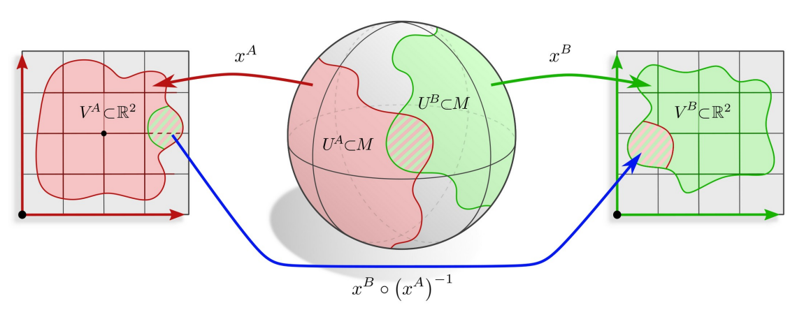
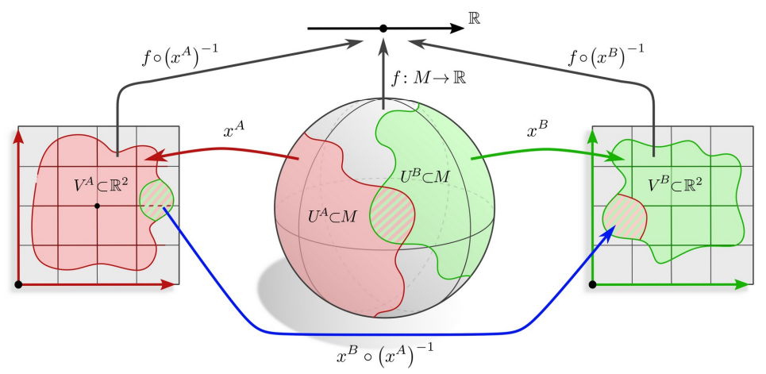
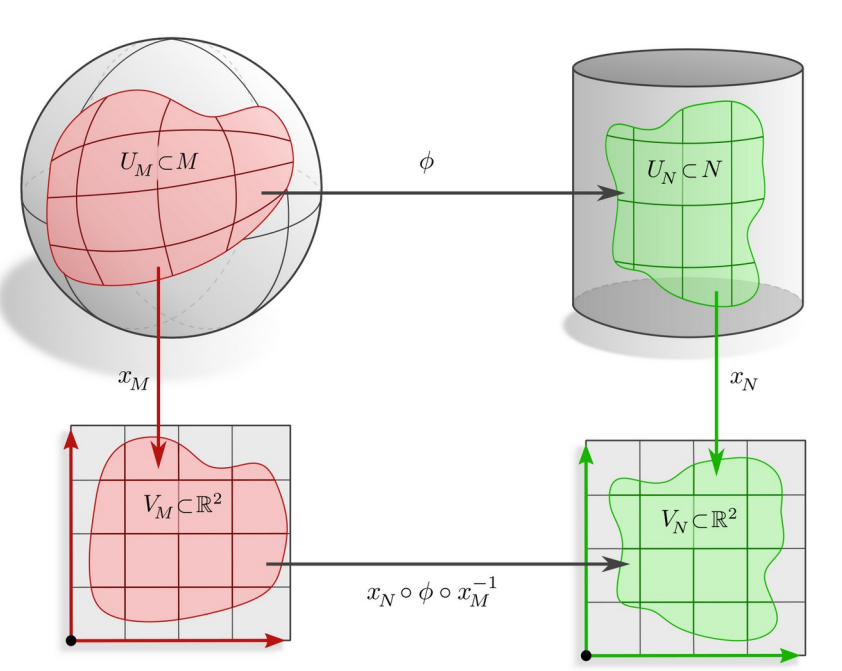
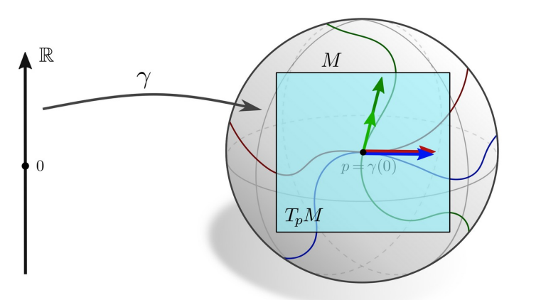

# Prerequisites 3: Manifolds

## Topological Manifolds
<b> Definition 1.1 </b> (Topological Manifold) <i> A topological space $$M$$ is called a d-dimensional (topological) manifold if around every point $$p \in M$$ there exists a neighborhood $$U \subset M$$ and a homeomorphism </i>

$$
x: U \to x(U) := V \subseteq \mathbb{R}^d
$$

The tuple $$(U,x)$$ is called a chart of $$M$$ and the components of $x_i$$ are called coordinates. 

Atlas of a manifold $$M$$ is a set of charts $$\mathcal{A} = \{(U^l, x^l)\}_{l \in L}$$ such that $$\bigcup_{l \in L} U^l = M$$.

The homeomorphisms $$x^B \circ (x^A)^{-1}$$ are called transition maps.

## Smooth Manifolds

We want to differentiate functions $$f: M \to \mathbb{R}$$ on the manifold.

Define differentiation on $$M$$ by pulling back functions via chart $$x^A$$ to $$\mathbb{R}^d$$.

$$
\begin{equation}
f \circ (x^A)^{-1}: V^A \to \mathbb{R}
\end{equation}
$$

ensure consistency among charts (that is charts need to be smoothly compatible) i.e. $$x^B \circ (x^A)^{-1}$$ is smooth.

We obtain a smooth manifold by adding an atlas with smooth transition maps.

<b> Definition 1.2 </b> (Smooth Atlas) <i> An atlas $$\mathcal{A}$$ is called smooth (differentiable) if the transition maps between any two overlapping charts are smooth (differentiable). </i>

<b> Definition 1.3 </b> (Smooth Manifold) <i> A smooth manifold is a topological manifold equipped with a smooth atlas. </i>

<b> Definition 1.4 </b> (Smooth map) <i> Let $$\phi: M \to N $$ be a map between smooth map at $$p \in M$$ if for some smooth charts $$(U_M, x_M)$$ and $$(U_N,x_N)$$ around $$p$$ and $$\phi(p)$$, the map $$x_N \circ \phi \circ x_M^{-1}$$ is smooth in the usual sense on $$\mathbb{R}^d$$ </i>

<b> Definition 1.5 </b> (Smooth curve) <i> A smooth curve on $$M$$ is a smooth map $$\gamma: \mathbb{R} \to M$$. </i>

<b> Definition 1.6 </b> (Tangent space (informal)) <i> The tangent space $$T_pM$$ at $$p \in M$$ is the vector space spanned by the tangent vectors $$\gamma'(0)$$ of smooth curves $$\gamma: \mathbb{R} \to M$$ with $$\gamma(0) = p$$. </i>

$$
\begin{equation}
T_pM := \{ \gamma'(0) \mid \gamma: \mathbb{R} \to M, \quad \gamma(0) = p, \quad \gamma \in \mathcal{C}^d, d \geq 1 \}
\end{equation}
$$

Disjoint union of tangent spaces forms the tangent bundle $$TM$$ of $$M$$.

## Riemmanian Manifolds

## Fiber Bundles